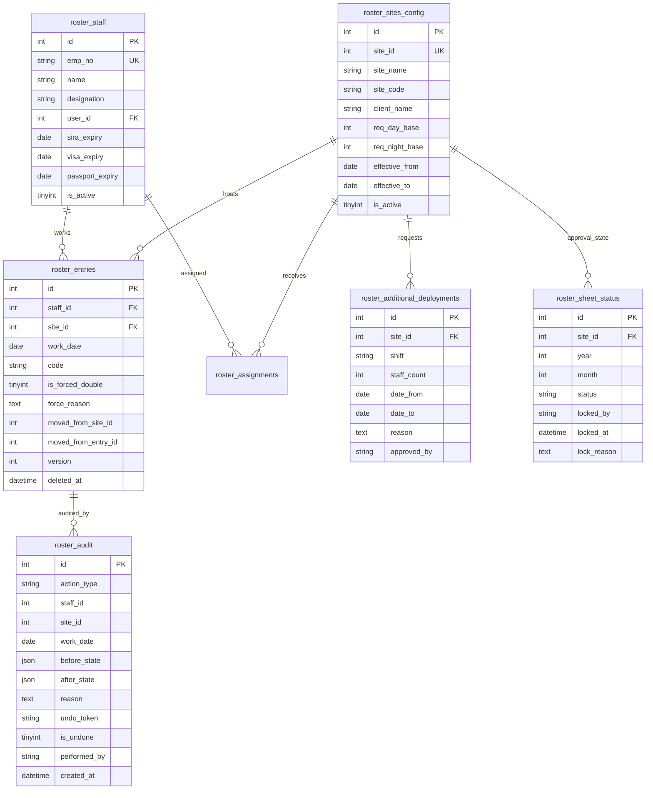

# Schema ERD: Attendance Roster Subsystem

```mermaid
erDiagram
    roster_staff ||--o{ roster_entries : "works"
    roster_staff ||--o{ roster_assignments : "assigned"
    roster_sites_config ||--o{ roster_entries : "hosts"
    roster_sites_config ||--o{ roster_assignments : "receives"
    roster_sites_config ||--o{ roster_additional_deployments : "requests"
    roster_sites_config ||--o{ roster_sheet_status : "approval_state"
    roster_entries ||--o{ roster_audit : "audited_by"

    roster_staff {
        int id PK
        string emp_no UK
        string name
        string designation
        int user_id FK
        date sira_expiry
        date visa_expiry
        date passport_expiry
        tinyint is_active
    }

    roster_sites_config {
        int id PK
        int site_id UK
        string site_name
        string site_code
        string client_name
        int req_day_base
        int req_night_base
        date effective_from
        date effective_to
        tinyint is_active
    }

    roster_entries {
        int id PK
        int staff_id FK
        int site_id FK
        date work_date
        string code
        tinyint is_forced_double
        text force_reason
        int moved_from_site_id
        int moved_from_entry_id
        int version
        datetime deleted_at
    }

    roster_additional_deployments {
        int id PK
        int site_id FK
        string shift
        int staff_count
        date date_from
        date date_to
        text reason
        string approved_by
    }

    roster_sheet_status {
        int id PK
        int site_id FK
        int year
        int month
        string status
        string locked_by
        datetime locked_at
        text lock_reason
    }

    roster_audit {
        int id PK
        string action_type
        int staff_id
        int site_id
        date work_date
        json before_state
        json after_state
        text reason
        string undo_token
        tinyint is_undone
        string performed_by
        datetime created_at
    }
```

